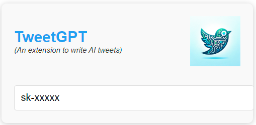

# TweetGPT

Write tweets using an AI. Just add your `openai` key in settings and you're ready to go.

 

### Todo: 

- [x] Inject button `TweetGPT`
- [x] settings page to update openai key
- [ ] write logic to fetch and update response